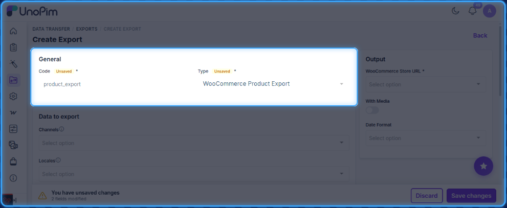
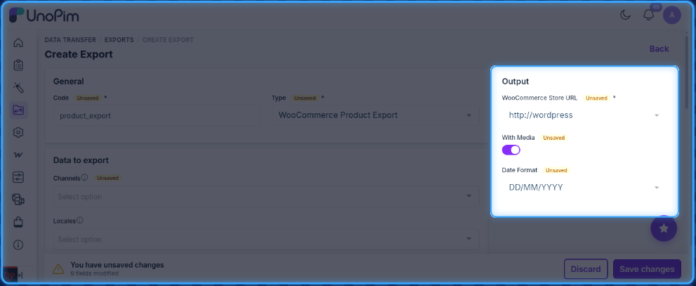
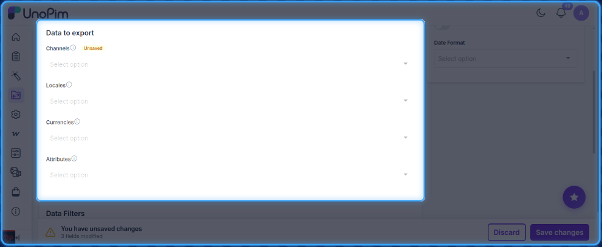
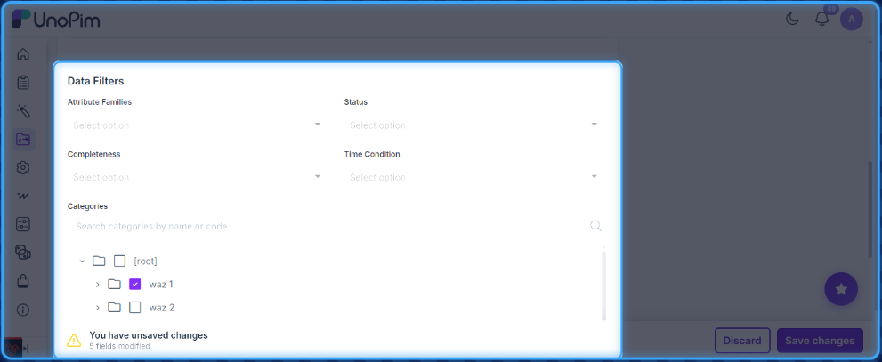
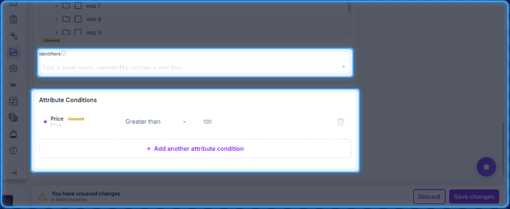

# Product Export

The UnoPim WooCommerce Connector allows users to export product data from UnoPim to WooCommerce through dedicated export jobs.

## Open the Export Jobs Section

To create a product export job, go to:

`Data Transfer > Exports`

From the Exports page, click **Create Export** in the top-right corner.

## Create a Product Export Job

While creating the export job, the user needs to:

- Enter the **Export Job Code**.
- Select **WooCommerce Product Export** as the export job type.

## Product Export Filters

After selecting the product export job type, configure the following filters as needed:

**Output**

- **WooCommerce Store URL**: Select the required WooCommerce store credentials.
- **With Media**: Enable this option if product images should also be exported to WooCommerce.
- **Date Format**: Select the date format to use for date-type attribute values.

**Data to Export**

- **Channels**, **Locales**, **Currencies**: Select the channel, locale, and currency to export data for.
- **Attributes**: Select the specific attributes to include in the export.

**Data Filters**

- **Attribute Families**, **Status**, **Completeness**, **Time Condition**: Narrow down products by these criteria.
- **Categories**: Restrict the export to products in selected categories.

- **Identifiers**: Enter specific product SKUs (comma or newline separated) to export.
- **Attribute Conditions**: Add conditions such as **Price greater than 100** to filter products by attribute values.

## Save and Run the Export Job

After filling in the required details, click **Save Export** to create and save the export job.

Once the export job is run, the user can monitor its progress from the **Job Tracker**.

After the export completes successfully, the products will be visible in the connected WooCommerce store.
